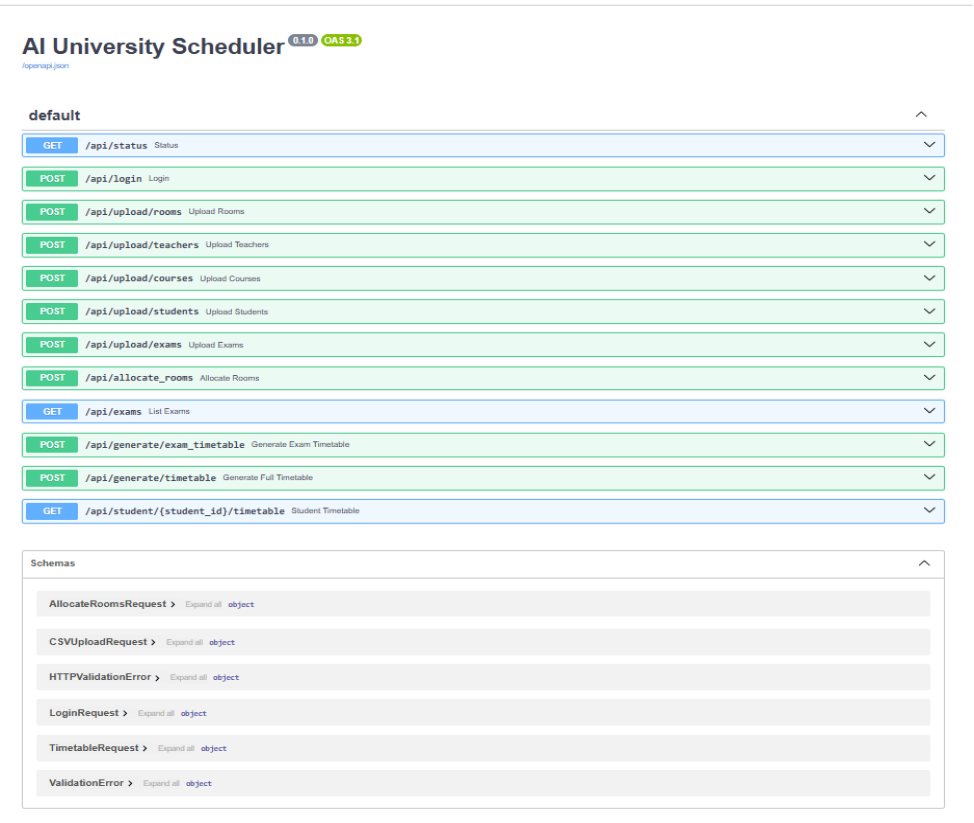
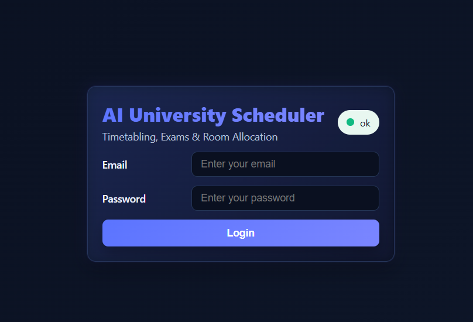
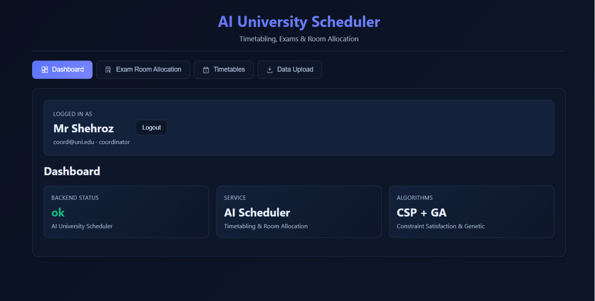
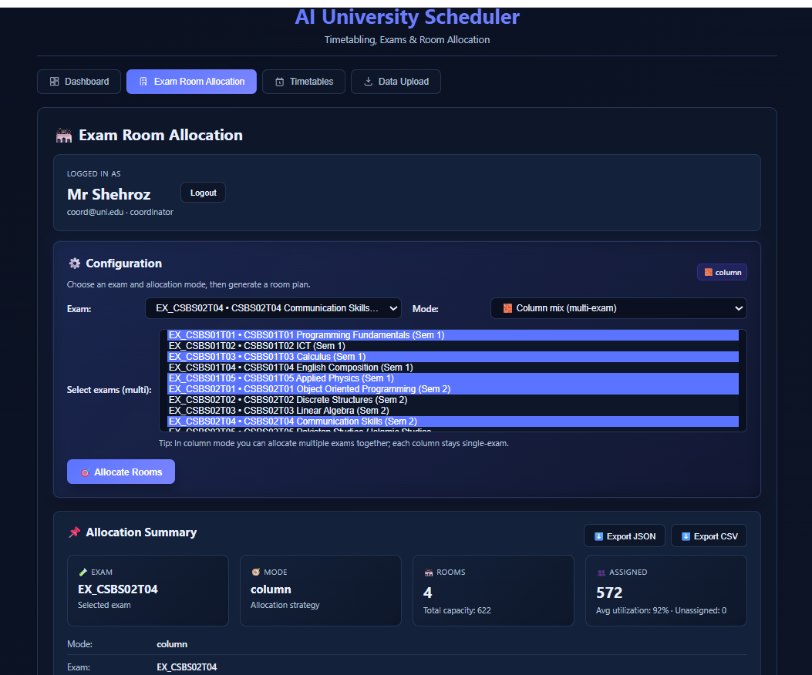
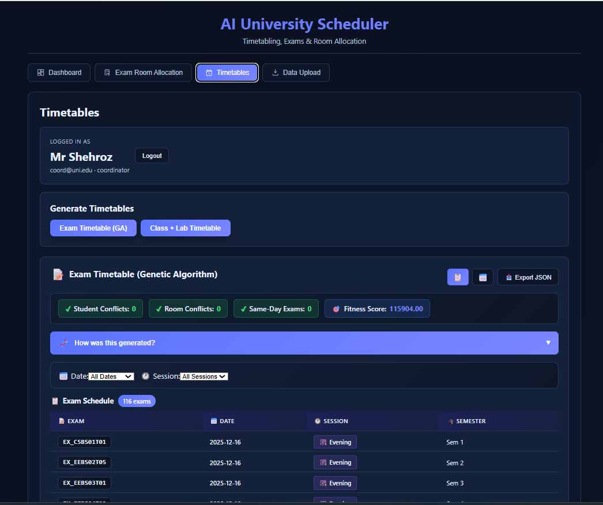
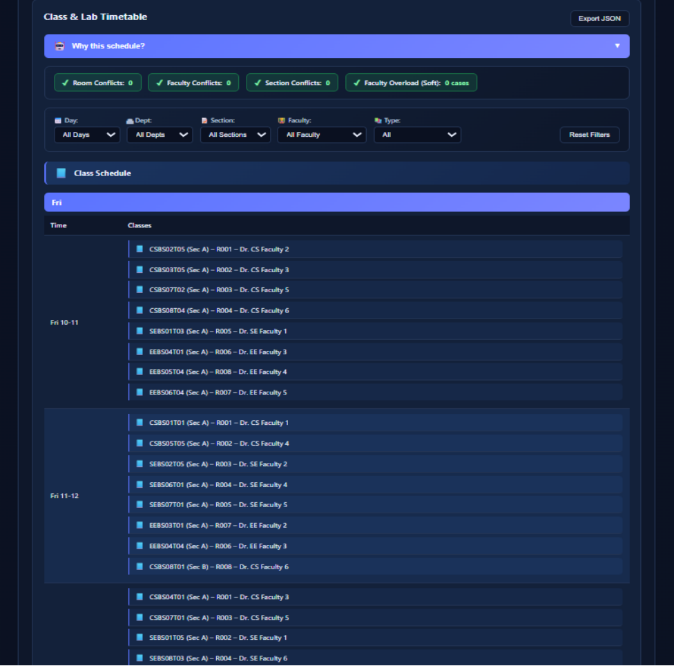
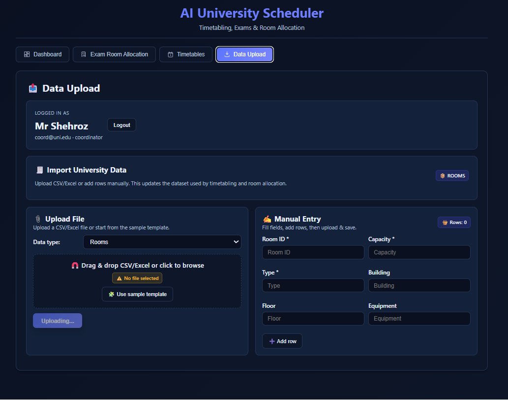
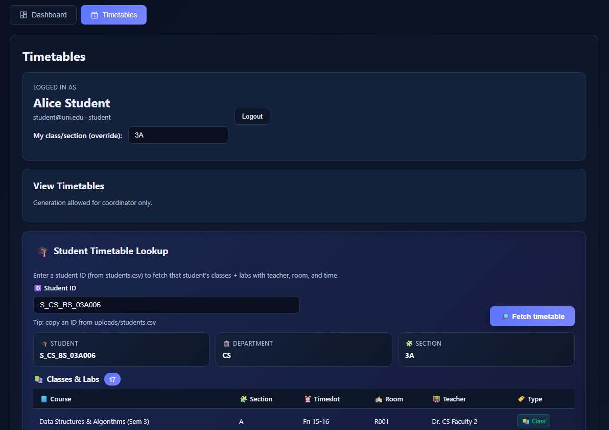

<div align="center">

# 🎓 AI University Scheduler
### Intelligent Timetabling, Exam Scheduling & Room Allocation System

[](https://python.org)
[](https://fastapi.tiangolo.com)
[](https://react.dev)
[](https://typescriptlang.org)
[](https://docker.com)
[](LICENSE)

<br/>

> An AI-powered university scheduling platform that automates class timetables, lab sessions, and exam scheduling using **Constraint Satisfaction Problems (CSP)** and **Genetic Algorithms (GA)** — delivering conflict-free, optimized schedules through an intuitive role-based web interface.

<br/>

[Features](#-features) • [Architecture](#-system-architecture) • [Screenshots](#-screenshots) • [Getting Started](#-getting-started) • [AI Concepts](#-ai-concepts) • [API Docs](#-api-reference) • [Team](#-team)

---

</div>

## 📌 Table of Contents

- [Overview](#-overview)
- [Problem Statement](#-problem-statement)
- [Features](#-features)
- [System Architecture](#-system-architecture)
- [AI Concepts Used](#-ai-concepts)
- [Screenshots](#-screenshots)
- [Tech Stack](#-tech-stack)
- [System Requirements](#-system-requirements)
- [Getting Started](#-getting-started)
- [Project Structure](#-project-structure)
- [Modules Description](#-modules-description)
- [Key Functions](#-key-functions)
- [Testing](#-testing--evaluation)
- [Limitations](#-limitations)
- [Team](#-team)
- [References](#-references)

---

## 🌟 Overview

**AI University Scheduler** is a full-stack intelligent scheduling system developed as a BSc Computer Science final project (Fall 2025). It automates the generation of:

- 📅 **Class Timetables** — using CSP (Constraint Satisfaction Problem)
- 🔬 **Lab Timetables** — with combined workload constraints
- 📝 **Exam Timetables** — optimized via Genetic Algorithm (GA)
- 🏛️ **Exam Room Allocation** — with capacity, department, and hybrid strategies

The system eliminates manual scheduling pain by enforcing hard constraints (no overlaps, room capacity) and soft constraints (workload balance, exam spread) automatically.

---

## ❗ Problem Statement

Universities face complex scheduling challenges every semester. Manual approaches using spreadsheets are:

| Problem | Impact |
|---|---|
| **Conflicts & Overlaps** | Teachers or rooms assigned to multiple sessions simultaneously |
| **Workload Imbalance** | Some teachers overloaded while others underutilized |
| **Inefficient Room Usage** | Rooms over/under-utilized due to poor capacity planning |
| **Time Consuming** | Coordinators spend days resolving scheduling conflicts |
| **Poor Adaptability** | Reschedule from scratch when data changes (new students, rooms, courses) |

This system automates scheduling decisions using AI, producing optimal timetables in seconds.

---

## ✨ Features

### Core Scheduling Features
- ✅ **Automated Class Timetable Generation** — Constraint-based scheduling for all sections
- ✅ **Lab Timetable Generation** — Respects combined lecture + lab daily limits (≤ 4 sessions/day)
- ✅ **Exam Timetable via Genetic Algorithm** — Minimizes student exam conflicts across slots
- ✅ **Exam Room Allocation** — 4 allocation strategies: Room-based, Department-based, Hybrid, Column
- ✅ **Timetable Caching** — Prevents repeated computation; returns cached results instantly

### Constraint Enforcement
- ✅ No teacher double-booking (hard constraint)
- ✅ No room double-booking (hard constraint)
- ✅ No section overlap (hard constraint)
- ✅ Teacher max 4 sessions/day (hard constraint)
- ✅ Max 1 lab/day/teacher (hard constraint)
- ✅ Room capacity matching section size (hard constraint)
- ✅ Exam spread optimization (soft constraint)
- ✅ Workload balance across teachers (soft constraint)

### User & Access Features
- ✅ **Role-Based Access Control** — 3 roles: Coordinator, Teacher, Student
- ✅ **Student Timetable Lookup** — Filter by Student ID, department, section
- ✅ **Data Upload** — CSV/JSON/YAML file upload for courses, rooms, students, teachers
- ✅ **Coordinator Dashboard** — Full control over data and schedule generation
- ✅ **Teacher View** — Read-only class/lab schedule display
- ✅ **Student View** — Personalized filtered weekly timetable

### Technical Features
- ✅ **FastAPI Backend** with async support
- ✅ **React + TypeScript SPA** frontend
- ✅ **Docker Support** — Backend & frontend Dockerfiles + `docker-compose.yml`
- ✅ **Pytest Test Suite** — Backend unit tests with controlled data
- ✅ **Heuristic GA Seeding** — GA starts from a greedy baseline for faster convergence

---

## 🏗️ System Architecture

### High-Level Block Diagram

```
┌─────────────────────────────────────────────────────────────────────┐
│                        FRONTEND (React + TypeScript)                 │
│                                                                       │
│  ┌──────────┐  ┌───────────────┐  ┌──────────────┐  ┌────────────┐ │
│  │  Login   │  │  Coordinator  │  │   Teacher    │  │  Student   │ │
│  │   Page   │  │  Dashboard    │  │    View      │  │   View     │ │
│  └──────────┘  └───────────────┘  └──────────────┘  └────────────┘ │
│                        Axios HTTP Client (api.ts)                     │
└─────────────────────────────┬───────────────────────────────────────┘
                              │ REST API
┌─────────────────────────────▼───────────────────────────────────────┐
│                      BACKEND (FastAPI / Python)                       │
│                           app.py                                      │
│                                                                       │
│  ┌────────────┐  ┌──────────────┐  ┌──────────────┐  ┌───────────┐ │
│  │   Login /  │  │  Timetable   │  │    Exam      │  │  Student  │ │
│  │   Auth     │  │  Generation  │  │  Scheduling  │  │ Timetable │ │
│  │  Routes    │  │  + Caching   │  │  + Rooms     │  │  Lookup   │ │
│  └────────────┘  └──────────────┘  └──────────────┘  └───────────┘ │
│                                                                       │
│  ┌──────────────────────────────────────────────────────────────┐   │
│  │                    Scheduler Package                          │   │
│  │  ┌─────────────────┐  ┌────────────────┐  ┌──────────────┐  │   │
│  │  │   Algorithms    │  │    Solvers     │  │    Utils     │  │   │
│  │  │                 │  │                │  │              │  │   │
│  │  │ class_timetable │  │  ga_optimizer  │  │  loader.py   │  │   │
│  │  │    _csp.py      │  │  evaluator.py  │  │ csv_loader   │  │   │
│  │  │ lab_timetable   │  │  heuristic_    │  │ constraints  │  │   │
│  │  │    _csp.py      │  │  builder.py    │  │  .py         │  │   │
│  │  │ exam_timetable  │  │                │  │  schemas.py  │  │   │
│  │  │    _ga.py       │  │                │  │              │  │   │
│  │  │ exam_room_      │  │                │  │              │  │   │
│  │  │ allocator.py    │  │                │  │              │  │   │
│  │  └─────────────────┘  └────────────────┘  └──────────────┘  │   │
│  └──────────────────────────────────────────────────────────────┘   │
└─────────────────────────────┬───────────────────────────────────────┘
                              │ File I/O
┌─────────────────────────────▼───────────────────────────────────────┐
│                       DATA LAYER (File-Based)                         │
│         YAML Defaults → CSV / JSON Upload Overrides                   │
│   courses.yaml │ teachers.csv │ rooms.csv │ students.json             │
└─────────────────────────────────────────────────────────────────────┘
```

---

### Data Flow Diagram (Level 0)

```
                    ┌──────────────────────────────┐
                    │                              │
   Coordinator ────▶│                              │────▶ Timetables
   Teacher     ────▶│   AI University Scheduler    │────▶ Exam Schedule
   Student     ────▶│         System               │────▶ Room Allocation
                    │                              │────▶ Student View
   Data Files  ────▶│                              │
   (CSV/JSON)       └──────────────────────────────┘
```

---

### Data Flow Diagram (Level 1)

```
┌─────────────────────────────────────────────────────────────────────┐
│                                                                       │
│  [Data Upload] ──▶ loader.py ──▶ [Normalized Data]                   │
│       │                                │                              │
│       │                    ┌───────────┼──────────────┐              │
│       │                    ▼           ▼              ▼              │
│       │           [ClassCSP]     [LabCSP]      [ExamGA]             │
│       │                    │           │              │              │
│       │                    └───────────┼──────────────┘              │
│       │                               ▼                              │
│       │                    [app.py Timetable Cache]                  │
│       │                               │                              │
│       │                    ┌──────────┴───────────┐                 │
│       │                    ▼                       ▼                 │
│       │           [Exam Room Allocator]   [Student Filter]           │
│       │                    │                       │                 │
│       └────────────────────┼───────────────────────┘                │
│                            ▼                                          │
│                     [React UI / Role Views]                           │
└─────────────────────────────────────────────────────────────────────┘
```

---

### Entity Relationship Diagram (ERD)

```
┌─────────────┐       ┌─────────────┐       ┌─────────────┐
│   TEACHER   │       │    COURSE   │       │    ROOM     │
│─────────────│       │─────────────│       │─────────────│
│ teacher_id  │◀──┐   │ course_id   │   ┌──▶│ room_id     │
│ name        │   │   │ course_name │   │   │ room_name   │
│ max_sessions│   │   │ department  │   │   │ capacity    │
│ department  │   │   │ credits     │   │   │ room_type   │
└─────────────┘   │   └──────┬──────┘   │   └─────────────┘
                  │          │           │
                  │   ┌──────▼──────┐   │
                  │   │  TIMETABLE  │   │
                  │   │─────────────│   │
                  └───│ teacher_id  │   │
                      │ course_id   │   │
                      │ room_id     │───┘
                      │ timeslot    │
                      │ section     │
                      │ day         │
                      └──────┬──────┘
                             │
                  ┌──────────▼──────────┐
                  │      STUDENT        │
                  │─────────────────────│
                  │ student_id          │
                  │ name                │
                  │ department          │
                  │ section             │
                  │ enrolled_courses[]  │
                  └─────────────────────┘

┌───────────────────────────────────────┐
│            EXAM_SCHEDULE              │
│───────────────────────────────────────│
│ exam_id  │ course_id  │ slot          │
│ room_id  │ students[] │ chromosome_id │
└───────────────────────────────────────┘
```

---

## 🤖 AI Concepts

### 1. Constraint Satisfaction Problem (CSP) — Class & Lab Scheduling

The class and lab timetable generators implement a **CSP-style backtracking search**. Each scheduling variable is a course-section pair that must be assigned a `(room, timeslot, teacher)` triplet satisfying all hard constraints:

```
Variables:   { (Course, Section) for all courses and sections }
Domain:      { (Room, Timeslot, Teacher) combinations }
Constraints:
  C1: teacher(a) ≠ teacher(b) if timeslot(a) = timeslot(b)       [no double-booking]
  C2: room(a) ≠ room(b) if timeslot(a) = timeslot(b)             [no room conflict]
  C3: section(a) ≠ section(b) if timeslot(a) = timeslot(b)       [no section overlap]
  C4: daily_sessions(teacher) ≤ 4                                 [workload cap]
  C5: capacity(room) ≥ size(section)                              [room capacity]
  C6: (lectures + labs)/day/teacher ≤ 4 AND labs/day/teacher ≤ 1  [lab combined load]
```

**Files:** `class_timetable_csp.py`, `lab_timetable_csp.py`

---

### 2. Genetic Algorithm (GA) — Exam Timetable Optimization

Exam scheduling is treated as an **optimization problem** solved by a Genetic Algorithm:

```
Chromosome:   { exam_id → slot_id }  (one mapping per exam)

Fitness Function (minimization):
  f(c) = Σ penalty_same_slot_student_conflict  ×  1000   [hard]
       + Σ penalty_same_day_student_conflict   ×  100    [medium]
       + Σ penalty_slot_overload               ×  10     [soft]
       + Σ penalty_spread_bonus               ×  -5      [reward]

GA Pipeline:
  1. Heuristic Seed  →  greedy placement (fewest conflicts first)
  2. Random Init     →  diverse population
  3. Selection       →  Tournament selection
  4. Crossover       →  Single-point crossover
  5. Mutation        →  Weighted smart mutation (conflict-aware)
  6. Elitism         →  Best chromosome preserved each generation
  7. Repeat until convergence or max generations reached
```

**Files:** `exam_timetable_ga.py`, `ga_optimizer.py`, `evaluator.py`, `heuristic_builder.py`

---

### 3. Exam Room Allocation — Optimization with Multiple Strategies

Four allocation strategies with different objectives:

| Strategy | Logic | Best For |
|---|---|---|
| **Room-Based** | Fill rooms by capacity order | General use |
| **Department-Based** | One department per room | Exam integrity |
| **Hybrid** | Department-first, then fill remaining | Balance |
| **Column-Based** | Students per exam in same column across rooms | Supervision ease |

**File:** `exam_room_allocator.py`

---

## 📸 Screenshots

> **Note:** The following screenshots illustrate the application's key views and workflows.

### 1. Working Backend (FastAPI)

> FastAPI server running with all endpoints live. Accessible via `/docs` for Swagger UI.

---

### 2. Login Page

> Role-based login portal supporting three user types: **Coordinator**, **Teacher**, and **Student**. Each role is routed to a different dashboard upon authentication.

---

### 3. Coordinator Dashboard

> The central hub for coordinators to trigger timetable generation, upload data files, and access all scheduling features. Full read/write access to all system functions.

---

### 4. Exam Room Allocation

> Coordinator-only feature. Displays student-to-room allocations with visual heat map. Supports switching between Room, Department, Hybrid, and Column allocation strategies.

---

### 5. Exam Timetable Generator

> GA-powered exam scheduling interface. Shows generated exam-to-slot mappings, fitness history graph, and evaluation metrics (conflicts, spread score, slot utilization).

---

### 6. Lab & Class Timetable Generator

> Available to both coordinators and teachers. Displays the weekly timetable grid with day/slot breakdown. CSP-generated, conflict-free schedule with teacher and room assignments visible.

---

### 7. Data Upload

> Coordinator-only data management panel. Upload CSV/JSON files for rooms, teachers, courses, and students. Uploaded data overrides YAML defaults and triggers cache invalidation.

---

### 8. Student Weekly Timetable Fetcher

> Students enter their Student ID to retrieve a personalized, filtered weekly timetable showing only their enrolled courses and assigned section's schedule.

---

## 🛠️ Tech Stack

### Backend
| Technology | Purpose |
|---|---|
| **Python 3.10+** | Core programming language |
| **FastAPI** | REST API framework with async support |
| **Pydantic** | Request/response data validation and schemas |
| **Uvicorn** | ASGI server for running FastAPI |
| **PyYAML** | Loading default YAML data files |
| **Pytest** | Backend unit testing framework |

### Frontend
| Technology | Purpose |
|---|---|
| **React 18** | Single-Page Application (SPA) framework |
| **TypeScript** | Type-safe JavaScript for UI development |
| **Vite** | Ultra-fast frontend build tool and dev server |
| **Axios** | HTTP client for API communication (`api.ts`) |
| **React Router** | Client-side routing and protected routes |
| **xlsx** | Excel file parsing for data uploads |

### DevOps / Infrastructure
| Technology | Purpose |
|---|---|
| **Docker** | Containerization for backend and frontend |
| **docker-compose** | Multi-service orchestration |

### Data Formats
| Format | Usage |
|---|---|
| **YAML** | Default data definitions (courses, rooms, teachers) |
| **CSV** | Data uploads and overrides |
| **JSON** | Student data, API responses, upload persistence |

---

## 💻 System Requirements

### Minimum Hardware
| Component | Specification |
|---|---|
| CPU | Dual-core (Intel i3 / AMD Ryzen 3) |
| RAM | 4 GB |
| Storage | 2–3 GB free space |
| Internet | Required for initial dependency installation |

### Recommended Hardware
| Component | Specification |
|---|---|
| CPU | Quad-core or higher (Intel i5 / AMD Ryzen 5+) |
| RAM | 8 GB or more |
| Storage | 5+ GB free space |
| Internet | Stable connection for package management |

### Software Requirements
| Software | Version |
|---|---|
| Python | 3.10+ |
| Node.js | 18+ |
| npm | Bundled with Node.js |
| Docker Desktop | Latest (optional, for containerized deployment) |
| OS | Windows 10/11 (recommended), Linux, macOS |

---

## 🚀 Getting Started

### Option A: Manual Setup

#### 1. Clone the Repository
```bash
git clone https://github.com/raoahmadgithub/ai-university-scheduler.git
cd ai-university-scheduler
```

#### 2. Backend Setup
```bash
# Navigate to backend directory
cd backend

# Create and activate a virtual environment
python -m venv venv
source venv/bin/activate        # Linux/macOS
venv\Scripts\activate           # Windows

# Install Python dependencies
pip install -r requirements.txt

# Start the FastAPI server
uvicorn app:app --reload --port 8000
```
> Backend available at: `http://localhost:8000`  
> API docs (Swagger UI): `http://localhost:8000/docs`

#### 3. Frontend Setup
```bash
# Open a new terminal and navigate to frontend directory
cd frontend

# Install Node.js dependencies
npm install

# Start the development server
npm run dev
```
> Frontend available at: `http://localhost:5173`

---

### Option B: Docker Compose (Recommended)
```bash
# Clone the repository
git clone https://github.com/raoahmadgithub/ai-university-scheduler.git
cd ai-university-scheduler

# Build and start all services
docker-compose up --build

# Stop services
docker-compose down
```
> Both frontend and backend start automatically. Frontend: `http://localhost:5173` | Backend: `http://localhost:8000`

---

### Default Login Credentials

| Role | Username | Password |
|---|---|---|
| Coordinator | `coordinator` | `admin123` |
| Teacher | `teacher_id` | `teacher123` |
| Student | `student_id` | `student123` |

> ℹ️ Credentials may vary based on your YAML configuration. Check `data/users.yaml`.

---

## 📁 Project Structure

```
ai-university-scheduler/
│
├── backend/
│   ├── app.py                        # FastAPI entry point, all routes
│   ├── requirements.txt              # Python dependencies
│   ├── pytest.ini                    # Pytest configuration
│   ├── Dockerfile                    # Backend Docker image
│   │
│   ├── scheduler/
│   │   ├── algorithms/
│   │   │   ├── class_timetable_csp.py    # CSP-based class scheduling
│   │   │   ├── lab_timetable_csp.py      # CSP-based lab scheduling
│   │   │   ├── exam_timetable_ga.py      # GA-based exam scheduling
│   │   │   └── exam_room_allocator.py    # Multi-strategy room allocation
│   │   │
│   │   ├── solvers/
│   │   │   ├── ga_optimizer.py           # Generic GA engine
│   │   │   ├── evaluator.py              # Fitness function + metrics
│   │   │   ├── heuristic_builder.py      # Greedy seed for GA
│   │   │   ├── csp_solver.py             # CSP solver utilities
│   │   │   └── fuzzy_scorer.py           # Fuzzy scoring utilities
│   │   │
│   │   └── utils/
│   │       ├── loader.py                 # YAML + CSV/JSON data loading
│   │       ├── csv_loader.py             # CSV parsing and persistence
│   │       ├── constraints.py            # Constraint helpers
│   │       ├── schemas.py                # Pydantic data models
│   │       ├── cli.py                    # CLI interface
│   │       ├── check_constraints.py      # Constraint validation
│   │       └── compute_overload.py       # Workload computation
│   │
│   ├── data/
│   │   ├── courses.yaml              # Default course definitions
│   │   ├── rooms.yaml                # Default room definitions
│   │   ├── teachers.yaml             # Default teacher definitions
│   │   └── students.json             # Default student records
│   │
│   └── tests/
│       ├── test_timetable.py             # Class/lab timetable tests
│       ├── test_exam_allocator.py        # Room allocation tests
│       └── test_exam_timetable_ga.py     # GA exam scheduling tests
│
├── frontend/
│   ├── package.json                  # Node.js dependencies
│   ├── vite.config.ts               # Vite build configuration
│   ├── Dockerfile                    # Frontend Docker image
│   │
│   └── src/
│       ├── App.tsx                   # Root SPA, auth, routing, role management
│       ├── api.ts                    # Centralized Axios HTTP client
│       ├── components/
│       │   ├── Login.tsx             # Login form component
│       │   ├── CoordinatorDashboard.tsx
│       │   ├── TeacherView.tsx
│       │   ├── StudentView.tsx
│       │   ├── TimetableGrid.tsx
│       │   ├── ExamScheduler.tsx
│       │   ├── RoomAllocator.tsx
│       │   └── DataUpload.tsx
│       └── types/
│           └── index.ts              # Shared TypeScript interfaces
│
└── docker-compose.yml                # Multi-service Docker orchestration
```

---

## 📦 Modules Description

### Backend Modules

#### `app.py` — API Application Layer
The FastAPI entry point. Defines all REST routes including:
- `POST /login` — Role-based authentication
- `POST /upload/{entity}` — File upload for rooms, teachers, courses, students
- `GET /generate-timetable` — Trigger full class + lab timetable generation (cached)
- `POST /generate-exam-timetable` — Run GA for exam scheduling
- `GET /exam-room-allocation` — Room assignment for exam students
- `GET /student-timetable/{student_id}` — Personalized student schedule

#### `class_timetable_csp.py` — Class Scheduling
CSP solver for weekly lecture timetables. Handles capacity, teacher/room/section conflicts, and daily teacher limits.

#### `lab_timetable_csp.py` — Lab Scheduling
CSP solver for lab sessions with combined daily load constraint: `(lectures + labs) ≤ 4` per teacher, and `≤ 1 lab/day/teacher`.

#### `exam_timetable_ga.py` — GA Exam Scheduling
Genetic Algorithm implementation for exam scheduling. Uses heuristic seeding from `heuristic_builder.py` and fitness evaluation from `evaluator.py`.

#### `ga_optimizer.py` — GA Engine
Reusable GA engine: population initialization → tournament selection → crossover → mutation → elitism → convergence.

#### `evaluator.py` — Fitness Evaluation
Computes fitness scores penalizing same-slot conflicts (×1000), same-day overloads (×100), and slot imbalance (×10).

#### `heuristic_builder.py` — Greedy Seed
Greedy exam placement (fewest conflicts first) used to seed the GA population with a high-quality starting solution.

#### `exam_room_allocator.py` — Room Allocation
Implements 4 allocation strategies: room-based, department-based, hybrid, and column-mix. Returns allocations + heat map data for UI.

#### `loader.py` — Data Loading
Loads YAML defaults then overrides with any uploaded CSV/JSON files. Normalizes data (e.g., ensures `enrolled_courses` is always a list).

#### `csv_loader.py` — CSV Persistence
Resolves upload directory paths, parses CSV text, and persists merged CSV/JSON state between sessions.

---

## 🔑 Key Functions

### `generate_full_timetable()` in `app.py`
```python
# Returns cached timetable if available;
# otherwise: load data → run ClassCSP → run LabCSP → cache result
```
Orchestrates the full class and lab schedule generation with caching to avoid redundant computation.

---

### `student_timetable(student_id, department, section)` in `app.py`
```python
# Filters the cached class/lab timetable by student's
# enrollment list and section, returns a personalized view
```
Builds an individual student's schedule by filtering the global timetable against their enrolled courses.

---

### `generate_exam_timetable(req)` in `app.py`
```python
# Instantiates ExamTimetableGA(), runs optimization,
# returns best_chromosome, fitness_history, metrics
```
Triggers the full Genetic Algorithm pipeline and returns results with convergence history.

---

### `ClassTimetableCSP.solve()` in `class_timetable_csp.py`
Central CSP loop that iterates over course-section pairs and assigns valid `(room, timeslot, teacher)` triplets while enforcing all hard constraints.

---

### `LabTimetableCSP.solve()` in `lab_timetable_csp.py`
Assigns lab sessions to lab-type rooms and slots. Enforces teacher-level combined daily cap and prevents lab/teacher/room collisions.

---

### `ExamTimetableGA.run()` in `exam_timetable_ga.py`
Controls the full GA lifecycle with smart mutation weighted toward high-conflict exams. Uses `GAOptimizer.run()` with tournament selection and elitism.

---

### `allocate_column_mix()` in `exam_room_allocator.py`
Column-based allocation where students sitting in the same column across rooms belong to the same exam. Supports supervision-friendly seating.

---

## 🧪 Testing & Evaluation

| Test Case | File | Input | Expected Output |
|---|---|---|---|
| Class & Lab Timetable Generation | `test_timetable.py` | Realistic YAML/CSV data | Valid JSON timetable, no conflicts |
| Room Capacity Respected | `test_exam_allocator.py` | 3 rooms, 12 students, 1 exam | No room exceeds capacity |
| Department-Based No Mix | `test_exam_allocator.py` | Students with departments | Each room has single department only |
| Hybrid Assigns All Students | `test_exam_allocator.py` | 3 rooms, 12 students | All students assigned, 0 unassigned |
| GA Runs & Chromosome Valid | `test_exam_timetable_ga.py` | 3 exams, 3 students, 3 slots | Valid chromosome dict, fitness computable |

### Running Tests
```bash
cd backend
pytest tests/ -v
```

---

## ⚠️ Limitations

| Limitation | Description |
|---|---|
| **No Real-Time Updates** | No WebSocket/push notifications; coordinators must re-upload data manually |
| **Limited Conflict UI** | Frontend doesn't offer interactive conflict resolution tools |
| **No Frontend Tests** | All unit tests are backend-only; no UI/E2E test coverage |
| **No Advanced Preferences** | Teacher slot preferences, variable session durations, and multi-campus scheduling are out of scope |
| **English Only** | No internationalization (i18n) support |
| **Desktop Oriented** | UI is not optimized for mobile/small screens |

> Most limitations stem from project time constraints and a deliberate focus on making the core AI scheduling logic robust and testable before adding infrastructure complexity.

---

## 👥 Team

**BSCSev-V-C | Fall 2025 | Artificial Intelligence Project**

| Name | Student ID | Backend Responsibilities | Frontend Responsibilities |
|---|---|---|---|
| **Ahmad Rashid** | 232385 | Exam Algorithms Specialist: `exam_room_allocator.py`, `exam_timetable_ga.py`, `evaluator.py`, `fuzzy_scorer.py`, `app.py` | UI/UX, timetable display, visualization |
| **Maheen Fatima** | 232528 | Class Timetable & Utilities: `class_timetable_csp.py`, `csp_solver.py`, `heuristic_builder.py`, `check_constraints.py`, `compute_overload.py`, `csv_loader.py`, `loader.py` | Frontend testing, build, deployment, documentation |
| **Fatima Yousaf** | 232388 | Lab Timetable & Integration: `lab_timetable_csp.py`, `ga_optimizer.py`, `cli.py`, `constraints.py`, `schemas.py` | API calls, data fetching, auth/session management |

---

## 📚 References

1. S. Russell and P. Norvig, *Artificial Intelligence: A Modern Approach*, 4th ed. Pearson, 2021.
2. R. Dechter, *Constraint Processing*. Morgan Kaufmann, 2003.
3. D. E. Goldberg, *Genetic Algorithms in Search, Optimization, and Machine Learning*. Addison-Wesley, 1989.
4. FastAPI Documentation — https://fastapi.tiangolo.com/
5. React Documentation — https://react.dev/
6. Vite Documentation — https://vitejs.dev/
7. Python Language Reference — https://docs.python.org/
8. Docker Documentation — https://docs.docker.com/

---

## 📄 License

This project is developed for academic purposes as part of a BSc Computer Science degree program. All rights reserved by the project authors.

---

<div align="center">

**⭐ If you found this project helpful, please star the repository!**

[](https://github.com/raoahmadgithub?tab=repositories)

</div>
